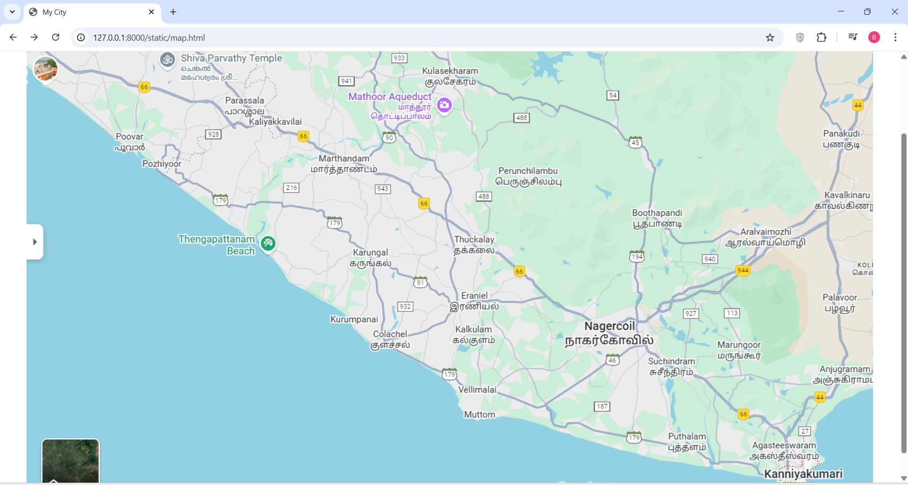
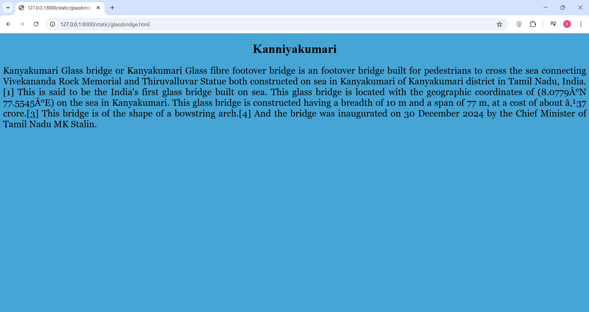
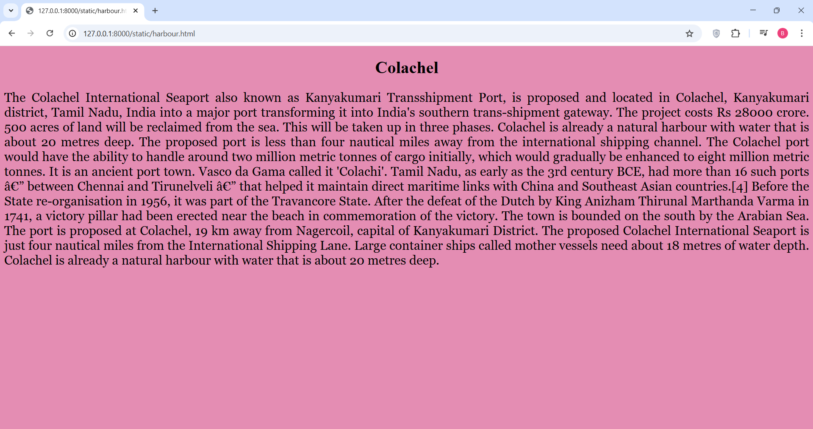
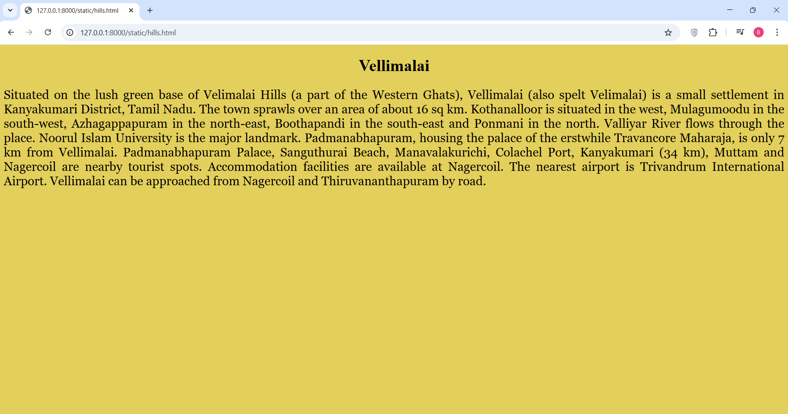
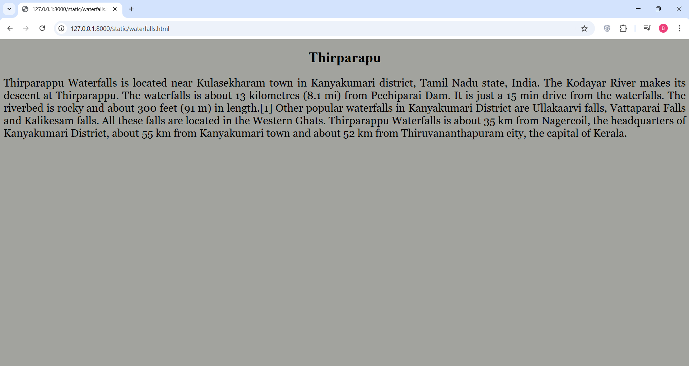
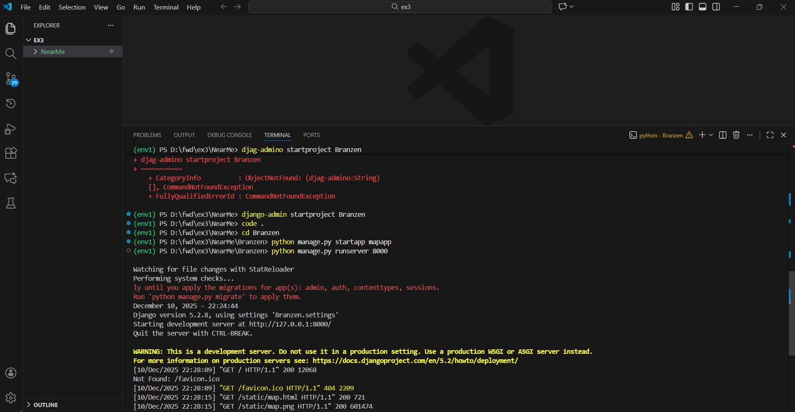

# Ex04 Places Around Me
## Date: 10-12-2025
## Register no:25006881


## AIM
To develop a website to display details about the places around my house.

## DESIGN STEPS

### STEP 1
Create a Django admin interface.

### STEP 2
Download your city map from Google.

### STEP 3
Using ```<map>``` tag name the map.

### STEP 4
Create clickable regions in the image using ```<area>``` tag.

### STEP 5
Write HTML programs for all the regions identified.

### STEP 6
Execute the programs and publish them.

## CODE
~~~
map.html
<html>
<head>
    <title>My City</title>
</head>

<body>
    <center>
        
        <map name="image-map">
            <area target="" alt="Colachel" title="Colachel" href="harbour.html" coords="692,693,538,575" shape="rect">
            <area target="" alt="Vellimalai" title="Vellimalai" href="hills.html" coords="722,674,805,731" shape="rect">
            <area target="" alt="Kanniyakumari" title="Kanniyakumari" href="glassbridge.html" coords="1236,808,1379,876" shape="rect">
            <area target="" alt="Thirparappu" title="Thirparappu" href="waterfalls.html" coords="565,73,692,150" shape="rect">
        </map>
    </center>
</body>
</html>

<!DOCTYPE html>
<html>
    <head>
        <h1><b>Kanniyakumari</b></h1>
    <style>
        p{
            text-align: justify;
            font-style: initial;
            font-family: Georgia, 'Times New Roman', Times, serif;
            color: black;
            font-size:x-large;

        }
        h1{
            text-align: center;
            color:rgb(0, 0, 0);
        }
        body{
            background-color: rgb(70, 165, 213);
        }
    </style>
    </head>
    <body>
        <p>
            Kanyakumari Glass bridge or Kanyakumari Glass fibre footover bridge is an footover bridge built for pedestrians to cross the sea connecting Vivekananda Rock Memorial and Thiruvalluvar Statue both constructed on sea in Kanyakumari of Kanyakumari district in Tamil Nadu, India.[1] This is said to be the India's first glass bridge built on sea.
            This glass bridge is located with the geographic coordinates of (8.0779°N 77.5545°E) on the sea in Kanyakumari.
            This glass bridge is constructed having a breadth of 10 m and a span of 77 m, at a cost of about ₹37 crore.[3] This bridge is of the shape of a bowstring arch.[4] And the bridge was inaugurated on 30 December 2024 by the Chief Minister of Tamil Nadu MK Stalin.
        </p>
    </body>
   
</html>

<!DOCTYPE html>
<html>
    <head>
        <h1><b>Colachel</b></h1>
    <style>
        p{
            text-align: justify;
            font-style: initial;
            font-family: Georgia, 'Times New Roman', Times, serif;
            color: black;
            font-size:x-large;

        }
        h1{
            text-align: center;
            color:rgb(0, 0, 0);
        }
        body{
            background-color: rgb(228, 141, 179);
        }
    </style>
    </head>
    <body>
        <p>
          The Colachel International Seaport also known as Kanyakumari Transshipment Port, is proposed and located in Colachel, Kanyakumari district, Tamil Nadu, India into a major port transforming it into India's southern trans-shipment gateway. The project costs Rs 28000 crore. 500 acres of land will be reclaimed from the sea. This will be taken up in three phases. Colachel is already a natural harbour with water that is about 20 metres deep. The proposed port is less than four nautical miles away from the international shipping channel. The Colachel port would have the ability to handle around two million metric tonnes of cargo initially, which would gradually be enhanced to eight million metric tonnes.
          It is an ancient port town. Vasco da Gama called it 'Colachi'. Tamil Nadu, as early as the 3rd century BCE, had more than 16 such ports — between Chennai and Tirunelveli — that helped it maintain direct maritime links with China and Southeast Asian countries.[4] Before the State re-organisation in 1956, it was part of the Travancore State. After the defeat of the Dutch by King Anizham Thirunal Marthanda Varma in 1741, a victory pillar had been erected near the beach in commemoration of the victory. The town is bounded on the south by the Arabian Sea.
          The port is proposed at Colachel, 19 km away from Nagercoil, capital of Kanyakumari District. The proposed Colachel International Seaport is just four nautical miles from the International Shipping Lane. Large container ships called mother vessels need about 18 metres of water depth. Colachel is already a natural harbour with water that is about 20 metres deep.
        </p>
    </body>
   
</html>

<!DOCTYPE html>
<html>
    <head>
        <h1><b>Vellimalai</b></h1>
    <style>
        p{
            text-align: justify;
            font-style: initial;
            font-family: Georgia, 'Times New Roman', Times, serif;
            color: black;
            font-size:x-large;

        }
        h1{
            text-align: center;
            color:rgb(0, 0, 0);
        }
        body{
            background-color: rgb(227, 207, 91);
        }
    </style>
    </head>
    <body>
        <p>
           Situated on the lush green base of Velimalai Hills (a part of the Western Ghats), Vellimalai (also spelt Velimalai) is a small settlement in Kanyakumari District, Tamil Nadu. The town sprawls over an area of about 16 sq km. Kothanalloor is situated in the west, Mulagumoodu in the south-west, Azhagappapuram in the north-east, Boothapandi in the south-east and Ponmani in the north.
           Valliyar River flows through the place. Noorul Islam University is the major landmark. Padmanabhapuram, housing the palace of the erstwhile Travancore Maharaja, is only 7 km from Vellimalai. Padmanabhapuram Palace, Sanguthurai Beach, Manavalakurichi, Colachel Port, Kanyakumari (34 km), Muttam and Nagercoil are nearby tourist spots.
           Accommodation facilities are available at Nagercoil. The nearest airport is Trivandrum International Airport. Vellimalai can be approached from Nagercoil and Thiruvananthapuram by road.
            
        </p>
    </body>
   
</html>

<!DOCTYPE html>
<html>
    <head>
        <h1><b>Thirparapu</b></h1>
    <style>
        p{
            text-align: justify;
            font-style: initial;
            font-family: Georgia, 'Times New Roman', Times, serif;
            color: black;
            font-size:x-large;

        }
        h1{
            text-align: center;
            color:rgb(0, 0, 0);
        }
        body{
            background-color: rgb(162, 163, 158);
        }
    </style>
    </head>
    <body>
        <p>
            Thirparappu Waterfalls is located near Kulasekharam town in Kanyakumari district, Tamil Nadu state, India.
            The Kodayar River makes its descent at Thirparappu. The waterfalls is about 13 kilometres (8.1 mi) from Pechiparai Dam. It is just a 15 min drive from the waterfalls. The riverbed is rocky and about 300 feet (91 m) in length.[1]
            Other popular waterfalls in Kanyakumari District are Ullakaarvi falls, Vattaparai Falls and Kalikesam falls. All these falls are located in the Western Ghats.
            Thirparappu Waterfalls is about 35 km from Nagercoil, the headquarters of Kanyakumari District, about 55 km from Kanyakumari town and about 52 km from Thiruvananthapuram city, the capital of Kerala.
        </p>
    </body>
   
</html>

~~~


## OUTPUT








## RESULT
The program for implementing image maps using HTML is executed successfully.
